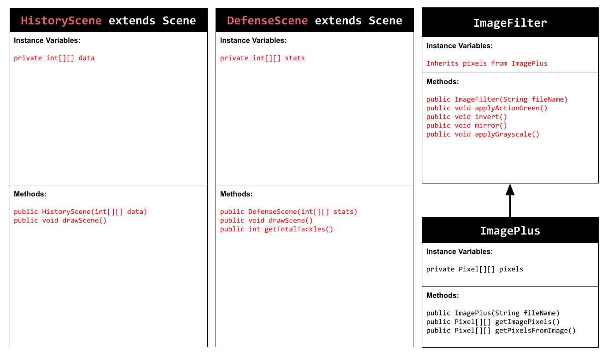
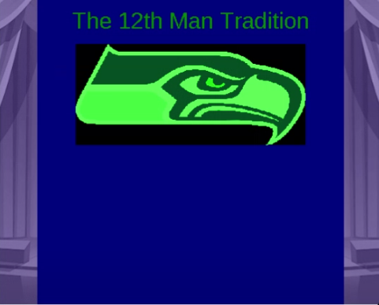

# Unit 5 - Personal Narrative / Interest Animation

## Introduction

Images are often used to portray our personal experiences and interests. We also use image filters and effects to change or enhance the mood of an image. When combined into collages and presentations, these images tell a story about who we are and what is important to us. Your goal is to create an animation using The Theater and Scene API that consists of images of your personal experiences and/or interests. In this animation, you will incorporate data related to these experiences and/or interests that can be organized in a 2D array, and use image filters and effects to change or enhance the mood of your images.
## Requirements

Use your knowledge of object-oriented programming, two-dimensional (2D) arrays, and algorithms to create your personal narrative collage or animation:
- **Write Scene subclasses** – Create two Scene subclasses: either two core parts of your personal life, or two components of a personal interest. Each class must contain a constructor and private instance variable with data related to the scene
- **Create at least two 2D arrays** – Create at least two 2D arrays to store the data that will make up your visualization.
Implement algorithms – Implement one or more algorithms that use loops and logic that operate on the data in your 2D arrays.
- **Create a visualization** – Create an animation that conveys the story of the data by illustrating the patterns or relationships in the data.
- **Image Filters** – Utilize the image filters created in this unit (and possible new filters) that show a personal flare to the images used in your animation.
- **Document your code** – Use comments to explain the purpose of the methods and code segments and note any preconditions and postconditions.

## UML Diagram

## Video

Click on the image to play the video.

## Story Description

My animation showcases the history and defensive dominance of the Seattle Seahawks. The first scene highlights important retired jersey numbers and traditions, including the famous “12th Man,” which represents the fans and their impact on the game. It visually presents key historical numbers and the years jerseys were retired, while using crowd noise and other effects to create a stadium atmosphere.

The second scene shifts to the “Legion of Boom,” the Seahawks’ dominant defensive unit from the early 2010s. This group included players like Richard Sherman, Earl Thomas, and Kam Chancellor. The animation emphasizes their defensive strength by displaying total tackles and applying bold image filters.

The data represented in 2D arrays directly connects to the story:

numbersData (2D array) stores historical jersey numbers and the year each was retired.

Column 0 → Jersey number

Column 1 → Year retired
This supports the historical theme of Scene 1.

defenseStats (2D array) stores defensive statistics.

Column 0 → Interceptions

Column 1 → Tackles

Column 2 → Forced fumbles
This supports Scene 2 by allowing the program to calculate total tackles and demonstrate statistical dominance.

The 2D arrays organize related information into rows (one player or one historical entry per row) and columns (specific categories of data), which makes it easy to loop through and display meaningful football history and performance statistics.

## Image Filter Analysis

The applyActionGreen() filter modifies each pixel by increasing the green value while decreasing red and blue values. Specifically, green is multiplied by 1.8 (capped at 255 to prevent overflow), red is divided by 3, and blue is divided by 3. This creates a strong green tint effect, which matches the Seahawks’ team colors and gives the image a dramatic, energetic look. Mathematically, each pixel’s RGB values are adjusted individually, which changes the overall color balance of the image without affecting its structure or brightness pattern.

The applyGrayscale() filter converts the image to black and white by averaging the red, green, and blue values of each pixel Then it sets red = average, green = average and blue = average. This removes all color information and keeps only brightness intensity. The result emphasizes contrast and detail rather than team colors, giving the defense scene a more serious and dramatic tone.
